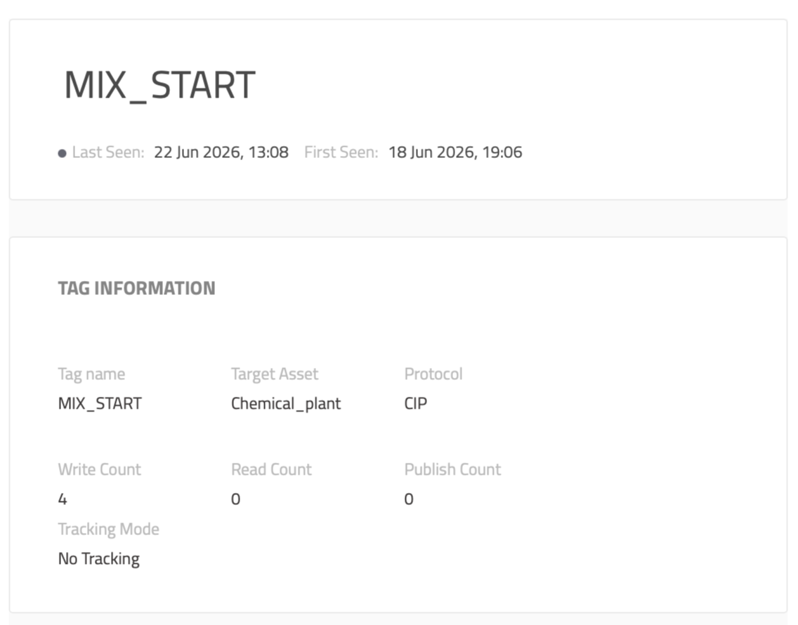

The investigation section of Claroty provides a series of pages with data information, such as captured process values and network sessions from assets. These pages, on their own, proivde raw data that can be used to aid in understanding what may have happened to or between assets.

---
## TASK 1: Investigating Process Values
* Navigate to `Investigation` > `Process Values`.
  
* A *process value* is an operational value that an industrial device is monitoring or controlling. 
    * For example, temperature, pressure, on/off state, etc.
    * If you need to answer "What changed?", then investigating process values may be the appropriate next step.
  
* Perhaps recently, the **Chemical_plant** asset had unexpectedly started the **MIX_START** procedure and we need to find out why.
  
* Filter **Access Types** by **Write**.
  
* Search for the process value with the *Target Asset* **Chemical_plant**

* Open that tag's details and review the information given
    * How many writes were observed for that tag?
    * Which asset issued the commands?
    * What protocol carried the commands?
    * Does this evidence prove that the writes were unauthorized? Why or why not?
    * What evidence should be collected next?
  
* In **Source Assets**, select the listed asset to procede to its page, then switch to the **Comunication** tab.
  
* Under **Baselines**, filter by *Protocol: CIP* and *Access Type: Write* and review the results:
    * Does it appear that it is normal behavior for this asset to issue write commands to *Chemical_plant*?
  
* What other assets has this asset written to, if any?

### TASK 1 REFLECTION

* In a real environment, what would your next step be after discovering the source of the write change?
* What would make a *MIX_START* command suspiscious? 

---

## TASK 2: Investigating Network Sessions
* Navigate to `Investigations` > `Network Sessions`.
- Network traffic and health
- Are there errors?
- What generates the most traffic?

- raw data of what firewalls rules should be **
    - as we approach 0 trust we want to limit east/west traffic

### TASK 2 REFLECTION
- x