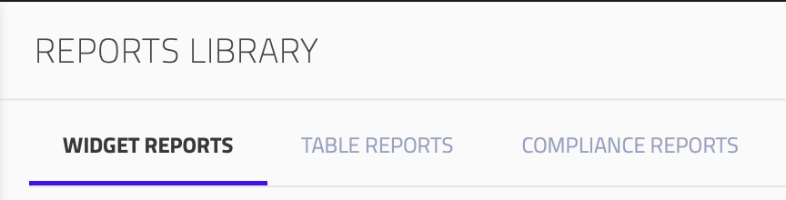
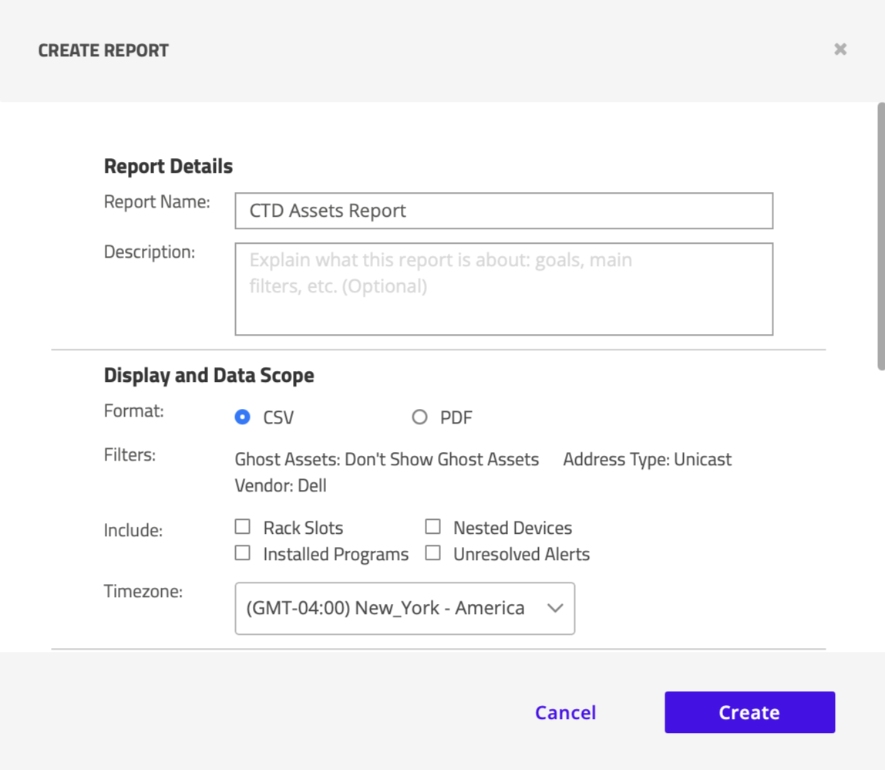
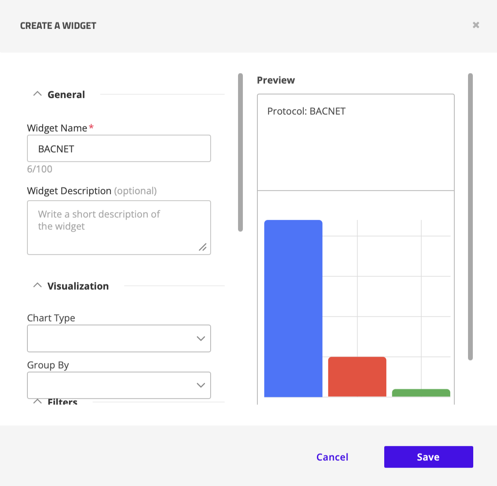

Blurb

- Understand how to create custom reports
- Determine the location of reports

---

## TASK 1: Reports Library
* Navigate to `Reports` > `Reports Library`.
  
* Predefined and custom reports are stored in the **Reports Library**, where they can be downloaded and edited.
    * *Widget*, *Table*, and *Compliance* reports are listed in their respective tabs.

* Claroty creates **Predefined** reports, such as the widget reports *Risk Assessment* and *Visibility Overview*, a variety of table reports, and a variety of compliance reports.
  
* Click on the *Predefined* report titled **CTD Risk Assessment Report**. 
  
* The report will load, and on the left-hand side you will the option to **Download** the report, in addition to a table of contents for the report. 
  
* Take a minute to look through the report.
    * What information is included in the report?
    * What do you feel like the report may be missing?
    * Is there any information you would remove?
  
* Return to the **Reports Library** page and switch over to the **Table Reports** tab.
    - What is different about these reports? Can you view them in the browser?
  
* Switch over to the **Compliance Reports** tab.
    - How are these reports similar to the other report types, and how do they differ?

### TASK 1 REFLECTION
* What types of information does Claroty communicate through the predefined Widget Reports, Table Reports, and Compliance Reports?
    
---

## TASK 2: Creating Custom Table Reports
* Navigate to `Visibility` > `Assets`.
  
* Filter the **Vendor** by *Dell*.
  
* Select the kebab menu (**⋮**), click *Select Columns*, and select all column options.
  
* Check **□** to select all the filtered assets, then select the kebab menu (**⋮**) and click *Create a New Table Report*.

* The **Create Report** pop up menu will appear and provide a variety of options for the report, including report details (name, description), the scope of data to be include, who the report should be shared with (CTD users), and the option to enable recurrence.
  
* Fill out the report with the appropriate values, such as `CTD Assets Report - Dell` for name, select *PDF* for export format, and all available include options.
  
* Select **Create* to save the report.
  
* Navigate to `Reports` > `Reports Library` > `Table Reports` and locate the custom table report that you just created. Under **Actions**, *Download* the custom report as a <u>PDF</u>.
    * It may take a minute or so for the download to appear and complete.
  
* Once the download completes, open and view the PDF from your Downloads folder.

## TASK 2 REFLECTION
* How could table reports to create robust, or specific, asset inventories?
* How could table reports be used to share information with personnel who do not have direct access to CTD?
* When would a custom table report be more useful than viewing the information directly in CTD?

---

## TASK 3: Creating Custom Widget Reports
* Navigate to `Visibility` > `Assets`.
  
* From the kebab menu, select *Create a Widget* to open the **Create a Widget** pop up menu.
    * The widget reports allow for visible representation of data, such as choosing specific chart types. Filters can also be adjusted from within the widget page.

* Name the widget `BACNET`. Select *Horizontal Bar* for **Chart Type**, *OT* for **Class**, and *BACNET* for **Protocol**.
  
* Select **Save** to create the custom widget.
  
* Navigate to `Reports` > `Reports Editor`. 
  
* Select **+ Add Widget**, select **Custom Widgets** in the grey sidebar, select the custom widget you previously created, and then select **Add Widgets**.
    - This will add the widget(s) you created to the new custom report.
  
* Select **Create** in the top right corner, fill out the widget report details as necesasry, then select **Create** again.
  
* Navigate to `Reports` > `Reports Library` and locate your custom widget report.

### TASK 3 REFLECTION
* Why might it be useful to have a custom widget for a specific vendor, protocol, etc.?

---

## TASK 4: Scheduling Reports
* Navigate to `Reports` > `Reports Library`.
  
* In the right most column, choose a report, then select the **⏱︎** symbol underneath **Actions**.
    - This will open up the edit menu, allowing you to edit the report name and share options in addition to scheduling.
    - Reports are scheduled to be sent on a weekly basis, and can be sent once a week to every day at a specified time. 
    - Recepients must be registered users within Claroty to be sent the report.
  
* **Update** your changes to return to the **Reports Library** page.

---

## TASKS REFLECTION
* How could specific scheduled reports be best used to maintain awareness of the environment?